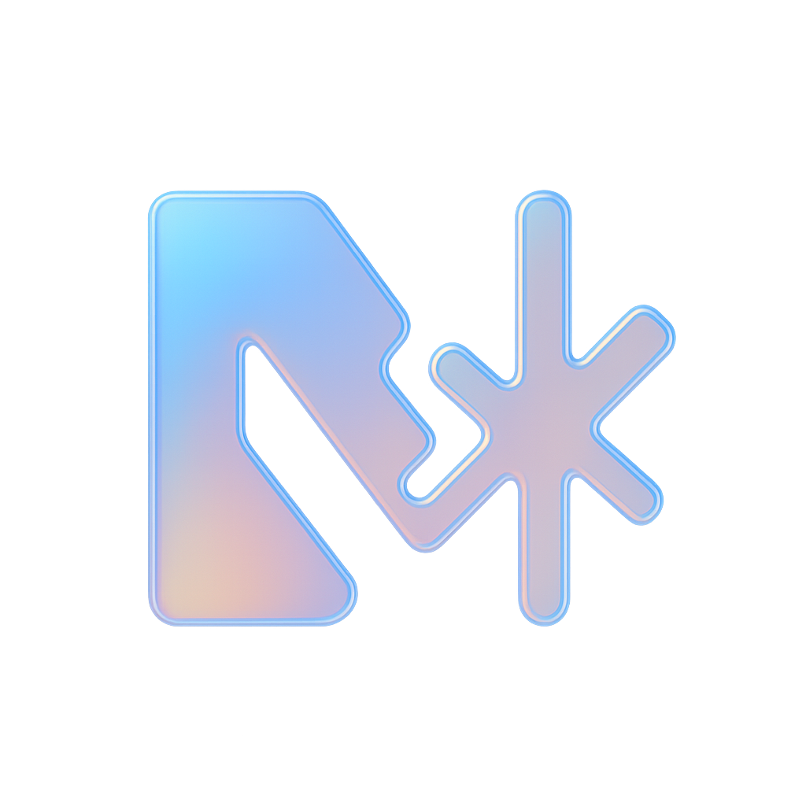

<p align="center">
  
</p>
<h1 align="center">Didac's Neovim Configuration</h1>
<p align="center"><em>— Made with Nix, and love. —</em></p>

---

> [!NOTE]
> This repository is meant to be used as a starting point
> to work with Neovim configuration with NVF Nix implementation.

## How to use:

```bash
nix run github:didacd/dnc
```

## How to install:

```bash
nix profile install github:didacd/dnc
```

## Offline install:

> [!IMPORTANT]
> There will be cases where you are working on systems that do not have
> internet access. And the only way to install is building the whole flake
> first. In that case, please refer to these steps.

### Build & export the package

To build the package, you need a machine with the same architecture as the one
you want to install. Then, clone the repo and build using:

```bash
nix build .
```

Then export the result by generating a `.nar` file:

```bash
nix-store --export $(nix-store -qR $(nix path-info .)) > dnc.nar
```

### Transfer & import on target machine

Use whatever you are confortable with to send the resulted `.nar` file to the
target machine. Once it is copied you need to import using this command:

```bash
nix-store --import < dnc.nar
```

### Run or add to PATH

It is important to note that importing the `.nar` file does not add it to your PATH.
For that you will need to manually copy the resulted store path and add it to your `.bashrc`
or whatever you use.
